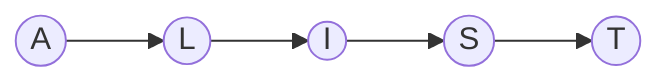
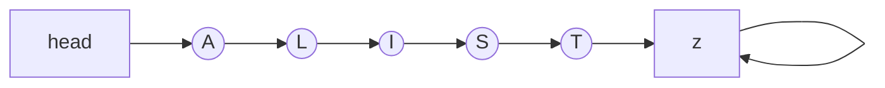
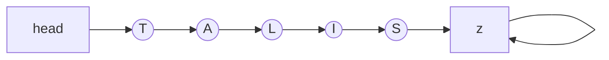
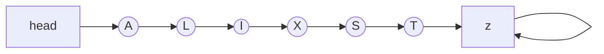
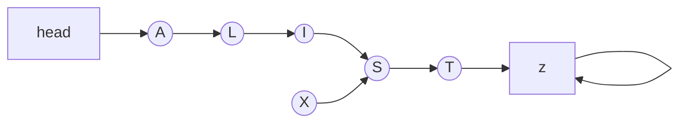

# Chapter 3: Elementary Data Structures
## Arrays

Perhaps the most fundamental data structure is the _array_, which is defined as a primitive in C and most other programming languages. An array is a fixed number of data items that are stored contiguously and that are accessed by an index. We refer to the ith element of the array `a` as `a[i]`. It is the responsibility of the programmer to store something meaningful in an array position `a[i]` before referring to it; neglecting this is on of the most common programming mistakes.

A simple example of the useof an array is given by the following program, which prints out all the prime numbers less than 1000. The method used, which dates back to the 3rd century B.C., is called the "sieve of Erathosthenes":

### Sieve of Erathosthenes
The algorithm works by creating an array with indices 0 to 1000. The indice will represent the number and the value associated with the indice will be a boolean that denotes if the number is prime.

We start of by setting all of the values to the indices to True to represent them potentially being prime. Then we systematically use variables `i` and `j` to construct all the products (`i*j`) that are less then 1000 and set the values to those indices to False. At the end of this process, all the indices that are still set to True are prime.

####  C Implementation
```c
{{#include ../../Algorithms_in_C/ch_3/eratosthenes/sieve.c}}
```

#### Rust Implementation
```rust
{{#include ../../Algorithms_in_C/ch_3/eratosthenes/sieve/src/main.rs}}
```

In the Rust implementation, I converted the for loops to while loops but, otherwise, I kept the code more or less the same.

## Linked Lists

The second elementary data structure to consider is the _linked list_, which is defined as a primitive in some programming languages (notably in Lisp) but not in C. However, C does provide basic operations that make it easy to use linked lists.

The primary advantage of linked list over arrays is that linked lists can grow and shrink in size during their lifetime. In particular, their maximum size need not be known in advance. A second advantage of linked lists is that they provide flexibility in allowing the items to be rearranged efficiently. This flexibility is gained at the expense of quick access to any arbitrary item in the list.

A linked list is a set of items organized sequentially, just like an array. In an array, the sequential organization is provided implicitly (by the position in the array); in a linked list, we use an explicit arrangement in which each item is part of a "node" that also contains a "link" to the next node.

``` admonish note
The book has a lot of amazing diagrams illustrating examples of linked lists. I do not think I can recreate the diagrams well, but I will attempt to do them in mermaid.js.
```

```admonish note
On another note, they way they discribe linked list makes me think that arrays that automatically increase in size as needed were not the norm them. That said, I do not think that our "automatically increasing in size" arrays every decrease their size when it is no longer needed. So, with respect to this book and to its focus on memory effeciency, it makes sense to use linked list over our automatically increasing in size arrays because it provides almost the same utility with the assurance that temporary increase in memory usage will be reclaimed, which will allow other parts of the program to use it later.
```


__Figure 3.1__: A linked list

Figure 3.1 shows a linked list, with items represented by letters, nodes by circles and links by lines connecting the nodes. We look in detail below at how lists are represented within the computer; for now we'll talk simply in terms of nodes and links.

Even the simple representation of Figure 3.1 exposes two details we must consider. First, every node has a link, so the link in the last node of the list must specify some "next" node. Our convention will be to have a "dummy" node, which we'll call _z_, for this purpose: The last node of the list will point to _z_, and _z_ will point to itself. In addition, we normally will have a dummy node at the other end of the list, again by convention. This node, which we'll call _head_, will pont to the first node in the list. The main purpose of the dummy nodes is to make cerain manipulations with the links, especially those involving the first and last nodes on the list, more convenient. Other conventions are discussed below. Figure 3.2 shows the list structure with these dummy nodes included.



__Figure 3.2__: A linked list with its dummy nodes 


Now, this explicit representation of the ordering allows certain operations to be performed much more efficiently than would be possible for arrays. For example, suppose that we want to move the T from the end of the list ot the beginning. In an array, we would have to move every item to make room for the new item at the beginning; in a linked list, we just change three links, as shown in Figure 3.3.


__Figure 3.3__: Rearranging a linked list

```admonish note
In Figure 3.3, I was unable to preserve the ordering while rearranging the links. As such, I can only produce the end result diagram and not the itermediate step.
```

We make the node containing T point to A, the node containing S point to _z_, and the _head_ point to T. Even if the list was very long, we could make this structural cahnge by changing just three links.

More important, we can talk of "inserting" and item into a linked list (which makes it grow by one in length), an operation that is unnatural and inconvenient in an array. Figure 3.4 shows how to insert X into our example list by ptting X in a node that points to S, then making the node containing I point to the new node.

Similarly, we can speak of "deleting" an item from a linked list (which makes it shrink by one in length). For example, the second list in Figure 3.4 shows how to delete X from the second list simply by making the node containing I point to S, skipping X. Now, the node containing X still exists (in fact it still points to S), and perhaps should be disposed of in some way -- the point is that X is no longer part of the list, and cannot be accessed by following links from the _head_. We will return to this issue below.



__Figure 3.4__: Insertion into and deletion from a linked list


On the other hand, there are other operations for which a linked list are not well-suited. The most obvious of these is "find the _k_th item" (find an item given its index): in an array this is done simply by accessing `a[k]`, but in a linked list we have to travel through _k_ links.

Another operation that is unnatural on linked lists is "find the item _before_ a given item." If all we have is the link to T in our sample list, then the only way we can find the link to S is to start as _head_ and travel through the linked list to find the node that points to T. As a matter of fact, this operations is necessary if we want to be able to delete a given node froma linked list: how else do we find the node whose link much be changed? In many applications, we can get around this problem by redesigning the fundemental deletion operation to be "delete the next node." A similar problem can be avoided for insertion by making the fundemental insertion operation "insert a given item _after_ a given node" in the list.
