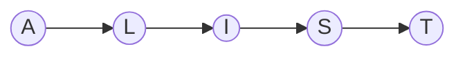
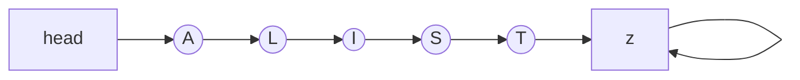
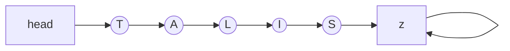
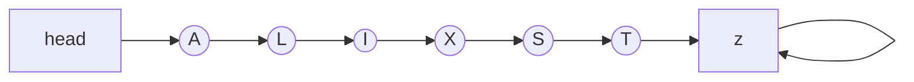
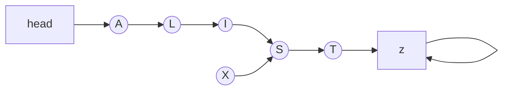

# Chapter 3: Elementary Data Structures
## Arrays

Perhaps the most fundamental data structure is the _array_, which is defined as a primitive in C and most other programming languages. An array is a fixed number of data items that are stored contiguously and that are accessed by an index. We refer to the ith element of the array `a` as `a[i]`. It is the responsibility of the programmer to store something meaningful in an array position `a[i]` before referring to it; neglecting this is on of the most common programming mistakes.

A simple example of the useof an array is given by the following program, which prints out all the prime numbers less than 1000. The method used, which dates back to the 3rd century B.C., is called the "sieve of Erathosthenes":

### Sieve of Erathosthenes
The algorithm works by creating an array with indices 0 to 1000. The indice will represent the number and the value associated with the indice will be a boolean that denotes if the number is prime.

We start of by setting all of the values to the indices to True to represent them potentially being prime. Then we systematically use variables `i` and `j` to construct all the products (`i*j`) that are less then 1000 and set the values to those indices to False. At the end of this process, all the indices that are still set to True are prime.

####  C Implementation
```c
{{#include ../../Algorithms_in_C/ch_3/eratosthenes/sieve.c}}
```

#### Rust Implementation
```rust
{{#include ../../Algorithms_in_C/ch_3/eratosthenes/sieve/src/main.rs}}
```

In the Rust implementation, I converted the for loops to while loops but, otherwise, I kept the code more or less the same.

## Linked Lists

The second elementary data structure to consider is the _linked list_, which is defined as a primitive in some programming languages (notably in Lisp) but not in C. However, C does provide basic operations that make it easy to use linked lists.

The primary advantage of linked list over arrays is that linked lists can grow and shrink in size during their lifetime. In particular, their maximum size need not be known in advance. A second advantage of linked lists is that they provide flexibility in allowing the items to be rearranged efficiently. This flexibility is gained at the expense of quick access to any arbitrary item in the list.

A linked list is a set of items organized sequentially, just like an array. In an array, the sequential organization is provided implicitly (by the position in the array); in a linked list, we use an explicit arrangement in which each item is part of a "node" that also contains a "link" to the next node.

``` admonish note
The book has a lot of amazing diagrams illustrating examples of linked lists. I do not think I can recreate the diagrams well, but I will attempt to do them in mermaid.js.
```

```admonish note
On another note, they way they discribe linked list makes me think that arrays that automatically increase in size as needed were not the norm them. That said, I do not think that our "automatically increasing in size" arrays every decrease their size when it is no longer needed. So, with respect to this book and to its focus on memory effeciency, it makes sense to use linked list over our automatically increasing in size arrays because it provides almost the same utility with the assurance that temporary increase in memory usage will be reclaimed, which will allow other parts of the program to use it later.
```


__Figure 3.1__: A linked list

Figure 3.1 shows a linked list, with items represented by letters, nodes by circles and links by lines connecting the nodes. We look in detail below at how lists are represented within the computer; for now we'll talk simply in terms of nodes and links.

Even the simple representation of Figure 3.1 exposes two details we must consider. First, every node has a link, so the link in the last node of the list must specify some "next" node. Our convention will be to have a "dummy" node, which we'll call _z_, for this purpose: The last node of the list will point to _z_, and _z_ will point to itself. In addition, we normally will have a dummy node at the other end of the list, again by convention. This node, which we'll call _head_, will pont to the first node in the list. The main purpose of the dummy nodes is to make cerain manipulations with the links, especially those involving the first and last nodes on the list, more convenient. Other conventions are discussed below. Figure 3.2 shows the list structure with these dummy nodes included.



__Figure 3.2__: A linked list with its dummy nodes 


Now, this explicit representation of the ordering allows certain operations to be performed much more efficiently than would be possible for arrays. For example, suppose that we want to move the T from the end of the list ot the beginning. In an array, we would have to move every item to make room for the new item at the beginning; in a linked list, we just change three links, as shown in Figure 3.3.


__Figure 3.3__: Rearranging a linked list

```admonish note
In Figure 3.3, I was unable to preserve the ordering while rearranging the links. As such, I can only produce the end result diagram and not the itermediate step.
```

We make the node containing T point to A, the node containing S point to _z_, and the _head_ point to T. Even if the list was very long, we could make this structural cahnge by changing just three links.

More important, we can talk of "inserting" and item into a linked list (which makes it grow by one in length), an operation that is unnatural and inconvenient in an array. Figure 3.4 shows how to insert X into our example list by ptting X in a node that points to S, then making the node containing I point to the new node.

Similarly, we can speak of "deleting" an item from a linked list (which makes it shrink by one in length). For example, the second list in Figure 3.4 shows how to delete X from the second list simply by making the node containing I point to S, skipping X. Now, the node containing X still exists (in fact it still points to S), and perhaps should be disposed of in some way -- the point is that X is no longer part of the list, and cannot be accessed by following links from the _head_. We will return to this issue below.



__Figure 3.4__: Insertion into and deletion from a linked list


On the other hand, there are other operations for which a linked list are not well-suited. The most obvious of these is "find the _k_th item" (find an item given its index): in an array this is done simply by accessing `a[k]`, but in a linked list we have to travel through _k_ links.

Another operation that is unnatural on linked lists is "find the item _before_ a given item." If all we have is the link to T in our sample list, then the only way we can find the link to S is to start as _head_ and travel through the linked list to find the node that points to T. As a matter of fact, this operations is necessary if we want to be able to delete a given node froma linked list: how else do we find the node whose link much be changed? In many applications, we can get around this problem by redesigning the fundemental deletion operation to be "delete the next node." A similar problem can be avoided for insertion by making the fundemental insertion operation "insert a given item _after_ a given node" in the list.

### C Implementation
C provides primitives operations that allow linked lists to be implemented directly. The following code fragment is a sample implementation of the basic functions that we have discussed so far.

```c
{{#include ../../Algorithms_in_C/ch_3/linked_lists/linked_list.c}}
```

```admonish note
The original code was a snippet that did not have the import line or a main function. I added those so that the code would compile. 
```

```admonish note
The use of the dummy node _head_ and _z_ do make the implementation easier. For example, the `deletenext` function never has to worry about `t->next->next` not existing, and the `insertafter` method never has to `t->next` because the first node will always be _head_ and the _head_ node will always have a next.
```

### Rust Implementation

I was unable to write this in Rust. It is not possible with Safe Rust because all of these nodes are owned by the linked_list and the main function that is passing them into these methods. I believe this is possible with Unsafe Rust, but I do not know how to write Unsafe Rust and I cannot justify that rabbit hole for this book.

The compromise is that I wrote it in Python.

### Python implementation
```python
{{#include ../../Algorithms_in_C/ch_3/linked_lists/linked_list.py}}
```

#### Thoughts
I'm kind of angry with how easy it was to translate this into Python. I love Rust, but it always hurts when you try to do "simple" things in programming that are actually extremely difficult in Rust and you end up struggling for hours.

That aside, the Python translation was straightforward. I added `__repr__` methods to both the Node and LinkedList so that I could see the output. The tricky part about that is that the Node method cannot print `node.next` because `z` points it itself, so it hits your recursive upper limit and crashes.

For the LinkedList, having the dummy `head` and `z` worked wonders in making the `insert_after` and the `delete_next` methods simple. It also does not limit the your options for new Nodes because the terminal node `z` is a pointer check to the class instance and not a equality check. So, in theory, I can add other nodes with the same properties of `z` to my linked_list and it should work fine.

I also liked how easy it was to skip the dummy nodes when iterating over the list. If you don't look at the implementation, (based off `main` and the output) you would never know that dummy nodes are being used. 

### JavaScript Implementation
```javascript
{{#include ../../Algorithms_in_C/ch_3/linked_lists/linked_list.js}}
```

#### Thoughts:
JavaScript is strange, VS Code is strange and I'm so tired that I am surprised I was able to do anything.

Also, I hate the copilit suggestions. It interrupts my thoughts. No matter what I do, the suggestions are still there?!

I think the suggestions are gone... FINALLY!

## Linked List -- Continued

The reader is encouraged to check these C implementations against the English language description given above. In particular, it is instructive at this stage to consider why the dummy nodes are useful. First, if the convention were to have `head` point to the beginning of the list rather than having a `head` node, then the `insert` procedure would need a special test for insertion at the beginning of the list. Second, the convention for `z` protects the `delete` procedure from (for exampe) a call to delete an item from an empty list.

Another common convention for terminating a list is to make the last node point to the first, rather than using either of the dummy odes `head` of `z`. This is called a _circular list_: it allows a program to go around and around the list. Using one dummy node to mark the beginning (and the end) of the list and to help handle the case of the empty list is sometimes convenient.

It is possible to support the operation "find the item _before_ a given item" by using a _doubly linked list_ in which we maintain two links for each node, one to the item before, one to the item after. The cost of providing this extra capability is doubling the number of link manipulations per basic operation, so it is not normally used unless specifically called for. As mentioned above, however, if a node is to be deleted and only a link to the node is available (perhaps it is also part of some other data structure), double linking may be called for.

```admonish note
The "Josephus problem" describe in the next paragraph would never be written in a modern book, but I find it very interesting that something like this was every okay to mention in a tech book.
```

We'll see many examples of applications of these and other basic operations on linked lists in later chapters. Since the operations involve only a few statements, we noramlly manipulate the list directly rather than use the precise procedure above. As an example, we consider next a program for solving the so-called "Josephus problem" in the spirit of Eratosthenes. We imagine that `N` people have decided to commit mass suicide by arranging themselves in a circle and killing the `M`th persion around the circle, closing ranks as each person drops out of the circle. The problem is to find out which person is the last to die (though perhaps that person would have a change of heart at the end!), or, more generally, to find the order in which the people are executed. For example, if `N` = 9 and `M` = 5, then people are killed in the order of 5, 1, 7, 4, 3, 6, 9, 2, 8. The following program reads in `N` and `M` and prints out this ordering:

### C implementation
```admonish note
The original code does not have comments. I added them for clarity.
```

```c
{{#include ../../Algorithms_in_C/ch_3/circular_linked_list/josephus_problem.c}}
```

### Python Implementation
The Python code stays pretty true to the C implementation.

```python
{{#include ../../Algorithms_in_C/ch_3/circular_linked_list/josephus_problem.py}}
```

### Rust Implementation
In Rust, I cannot use Linked List in they way Python and C do it, so I implemented a (bad) solution to the problem using a Vec.

```Rust
{{#include ../../Algorithms_in_C/ch_3/circular_linked_list/josephus/src/main.rs}}
```

## Back to the Book:
The program uses a circular linked list to simulate the sequence of executions directly. First, the list is built with keys from 1 to `N`: the variable `x` holds onto the beginning of the list as it is built, then the pointer in the last node in the list is set to `x`. Then, the program proceeds through the list, counting through `M` - 1 items and deleting the next, until only one is left (which then points to itself). Note the call to `free` for the delete, which corresponds to an execution: this is the opposite of `malloc` as mentioned before.

## Storage Allocation

C's pointers provide a convenient way to implement lists, as shown above, but there aere alternatives. In this section we discuss how to use `arrays` to implement linked lists and how this is related to the actual representation of memory of a computer, so that analysis of how a data structure is implemented as an array will give you some insight into how it might be represented at a low level in the computer. In particular, we're interested in seeing how several lists might be represented simultaneously.

In a direct-array representation of linked lists, we use indices instead of links. One way to proceed would be to define an array of records like those above, but using `integers` (for array indices) rather than pointers for the `next` field. An alternative, which often turns out to be more convenient, is to use "parallel arrays": we keep the items in an array `key` and the links in an array `next`. Thus, `key[next][head]` refers ti the information associated with the first item on the list, `key[next[next[head]]]` to the second, etc. The advantage of using parallel arrays is that the structure can be built "on top of" the data: the array `key` contains data and only data -- all the structure is in the parallel array `next`. For example, another list can be built using the same data array and a different parallel "link" array, or more data can be added with more parallel arrays. The following code implements the basic list operations using parallel arrays:

### C Implementation:
The errors you get when you try to compile code snippets from books can be rough, especially when you do not know the language well.

```c
{{#include ../../Algorithms_in_C/ch_3/linked_lists/array_linked_list/array_linked_list.c}}
```

### Rust Implementation:
I wrote this about two weeks ago, so I am a bit fuzzy on how I felt at the time of writing it. All I know is that I spent hours trying to write a node based linked list and, after giving up, I came back, I think a day later, and struggled translating this to Rust. I believe the tricky part was getting the indices right. If `insert_after` does not return the correct value for the next index, everything becomes wonky. 

```Rust
{{#include ../../Algorithms_in_C/ch_3/linked_lists/linked_list/src/main.rs}}
```

## Continue the Book

Each call on the storage allocation function `malloc` is replaced by simply incrementing the "pointer" `x`: it keeps track of the next unused position in the array.

```admonish note
I'm skipping the Figure examples in this section because I cannot draw them.
```

The crux of the matter is to consider how the built-in procedures `malloc` and `free` might be implemented. We presume that the only space for nodes and links are the arrays we've been using; this presumption puts us in the situation the system is in when it has to provide the capability to grow and shrink a data structure wuth a fixed data structure (the memory itself). For example, suppose that the node containing `A` is to be deleted from the example in Figure 3.5 and then disposed of. It is one thing to rearrange the links so that node is no longer hooked into the list, but what do we do with the space occupied by that node? And how do we find space for a node when `new` is called and more space is needed?

On reflection, the reader will see that the solution is clear: a linked list should be used to keep track of the free space! We refer to this list as the "free list." Then, when we `delete` a node from our list we dispose of it by `inserting` it into the free list, and when we need a `new` node, we get it by `deleting` it from the free list. This mechanism allows several different lists to occupy the same array.

When storage management is provided by the system, as in C, there is no reason to override in this way. The description above is intented to indicate how the storage management is done by the system. The actual problem faced by the system is rather more complex, as not all nodes are necessarily of the same size. Also, some systems relieve the user of the need to explicitly `free` nodes by using `garbage-collection` algorithms to remove any nodes not referenced by any link. A number of rather clever storage management algorithms have been developed to handle these two situations.

## Pushdown Stacks

We have been concentrating on structuring data in order to insert, delete, or access items arbitrarily. Actually, it turns out that for many applications, it suffices to consider various (rather stringent) restrictions on how the data structure is accessed. Such restrictions are beneficial in two ways: first, they can alleviate the need for the program using data structure to be concerned with its details (for example, keeping track of links to or indices of items); second, they allow simpler and more flexible implementations, since fewer operations need be supported.

The most important restricted-access data structure is the `pushdown stack`. Only two basic operations are involved: one can `push` an item into the stack (insert it at the beginning) and `pop` an item (remove it from the beginning). A stack operates somewhat like a busy executive's "in" box: work piles up in a stack, and whenever the executive is ready to do some work, he takes it off the top. This might mean that something get stuck in the bottom of the stack for some time, but a good executive would presumably manage to get the stack emptied periodically. It turns out that sometimes a computer program is naturally organized in this way, postponing some tasks while doing others, and thus pushdown stacks appear as the fundamental data structure for many algorithms.

We'll see a great many applications of stacks in the chapters that follow: for an introductory example, let's look at using stacks in evaluating arithmetic expressions. Suppose that one wants to find the value of a simple arithmetic expression involving multiplication and addition of integers, such as:

```
5 * (((9 + 8) * (4 * 6)) + 7
```

A stack is the ideal mechanism for saving intermediate results in such a calculation. The above example might be computed with the calls:

```
push(5);
push(9);
push(8);
push(pop() + pop());
push(4);
push(6);
push(pop()*pop());
push(pop()*pop());
push(7);
push(pop()+pop());
push(pop()*pop());
printf("%d\n", pop());
```

The order in which the operations are performed is dictated by the parentheses in the expression, and by the convention that we proceed from left to right. Other conventions are possible; for example 4*6 could be computed before 9+8 in the example above. And in C, the order in which the two `pop()` operations is performed is unspecified, so slightly more complicated code is needed for noncommutative operators such as subtract and divide.

Some calculators and some computing languages base their method of calculation on stack operations explicitly: every operations pops its argument from the stack and returns its results to the stack. As we'll see in Chapter 5, stacks often arise implicitly even when not used explicitly.

The basic stack operations are easy to implement using linked lists as in the following implementation:

### C Implementation
